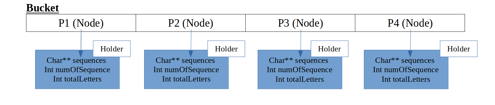
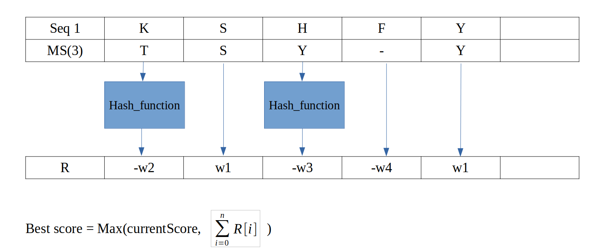

<div>
            
</div>

# Parallel Implementation Of Sequence alignment
###
## Problem definition:

Let Seq1 and Seq2 be a given Sequences of letters.
For all Mutant Sequences of Seq2 find an offset n which produce a maximum Alignment Score
against Seq1. Among all results, choose the Mutant Sequence MS(k) with the best Alignment Score

## Solution:

The master (node) read all the data from the file, which contains the weight, seq1, and all the other seq2 that resides in the file.<br>
The master split the sequences evenly between each process using “bucket sequence holder”.

### Bucket Sequence Holder:
Bucket sequence holder is a pre-defined data structure which i built to split all the sequences evenly between the nodes.<br>
The bucket’s length is at the same size of the number of processes which gets allocated, each cell in the bucket hold pointer to struct which holds array of sequences, 
total number of sequences and total length of all sequences.
Each time the master reads new seq2 from the file, he add the sequence to the cell which hold the minimum number of letters.<br>
The result is that each process (node) hold approximately the same amount of characters to check regardless of the amount of the sequences.

<div>
            
</div>

## MPI
After reading the file i used MPI <strong>statically</strong> to send the shared data (main sequence, weight) and the sequences from the holder to the corresponding process.
Each process calculate the alignment scores for every sequence he has, and send the result back to the master.<br>
The reason i used MPI statically is that communication between different nodes takes a lot of time. In dynamic approach the node need to communicate 
with the master and ask for the next sequence to preform the next task and so forth and it’s time consuming which lowers the performance significantly. 

## OpenMp
In each sequence i needed to check all the offset, i realized that each offset is independent from other offset hence, it allows me to parallel the offset.
In other words it means forking a team of threads that each one takes one offset and preform calculation on all the hyphens per that offset.

## Cuda
For each sequence there are a large amount of comparisons that must be made, so for each pair of sequences we have to go through each pair of characters and compare between them, this is a very large computational operation which cuda fits for this kind of tasks.
The kernel function gets as input:  seq1, seq2, offset, hyphen and result array.
Each thread in the block gets a location in seq2 to compare itself to the same location in seq1 and after the comparisons the corresponding threads gets into the location in the result array and set the relevant weight with sign.

## General idea of cuda’s work:

<div>
            
</div>

## Improvements:

1. <strong>Hashing the semi-conservative and conservative char array using kantor’s function.</strong><br>
One problem that worsen the preformance in cuda was that if pair of characters don’t match, we have to loop over two different char array(conservative & semi Conservative) 
at the worst case and check if the characters are reside in one of the string.
This approach is a very time consuming, so that i create hash table which return in o(1) if the characters are conservative or semi-conservative 
using kantor’s function.

2. <strong>Cuda stream.</strong><br>
All the kernel by defualt running on the default stream, i used cuda stream to run the kernel on different streams which improve performance significantly.

## pseudo: 
```
for each sequence in bucket:
algorithm: 
	input : Sequence M , Sequence S, Weight W, Offset O, Result Array R
	output : best alignment score
	
	#pragma omp for 
	for each offset  in Len(M) – Len(S):   			
		comupte_on_gpu(M, S , W, O) {
			for each hyphen in Len(S):
				R = kernel_function();	
		}  
		alignment_score  = get_best_score(R);
		
	return {alignment_score.n, alignment_score.k};
 ```

## Conclutions: 
Running on GTX 1050 TOTAL TIME TAKEN 1.840640 sec
